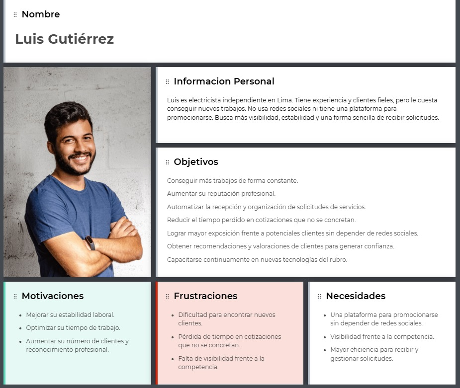
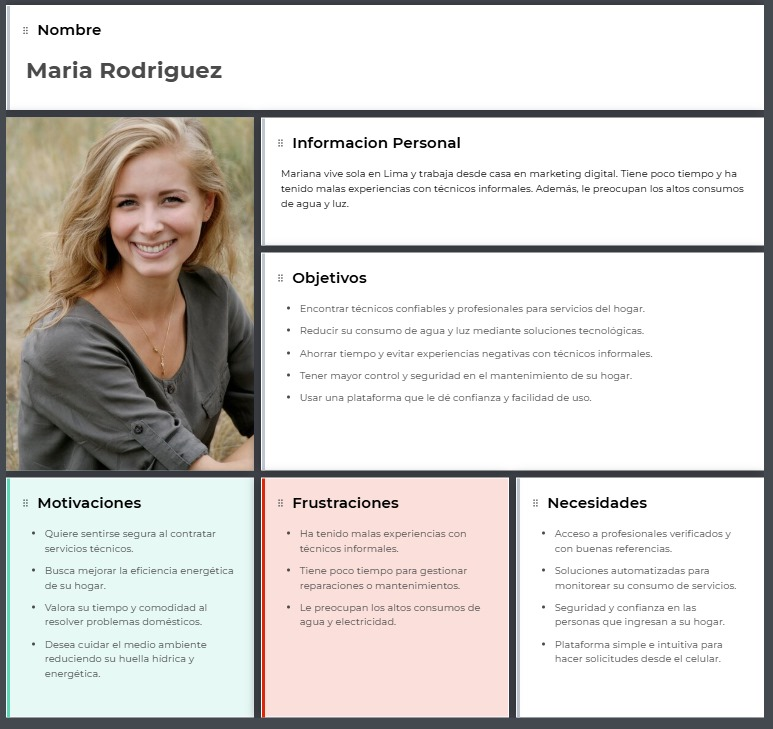
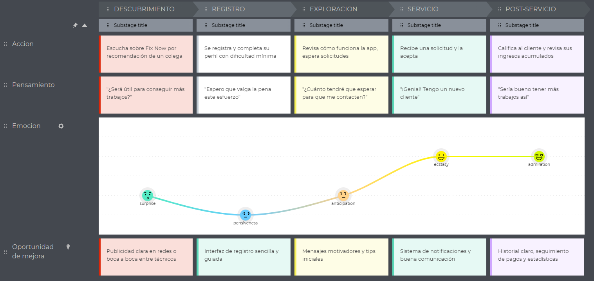
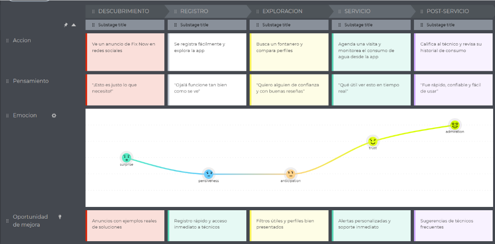

# Informe del Trabajo Final

**Universidad Peruana de Ciencias Aplicadas**

**Ingeniería de software**

**Desarrollo de Aplicaciones Open Source**

**Sección:** 4310

**Profesor:** Ivan Robles Fernández

**Nombre del StartUp:** TechMove

**Nombre del Producto:** FixNow

| Nombre                              | Código    |
| ----------------------------------- | ---------- |
| Bustamante Leveau Cameron Charllotte | u20231a804 |
| Urrutia Peña Jasmin Adriana          | u202310008 |
| Hallasi Saravia Miguel Angel | u202312391 |

**Ciclo 2025-01**

# Contenido

1. [Capítulo I: Introducción](#capítulo-i-introducción) 
    1.1. [Startup Profile](#11-startup-profile) 
    1.1.1. [Descripción de la Startup](#111-descripción-de-la-startup) 
    1.1.2. [Perfiles de integrantes del equipo](#112-perfiles-de-integrantes-del-equipo) 
    1.2. [Solution Profile](#12-solution-profile) 
    1.2.1 [Antecedentes y problemática](#121-antecedentes-y-problemática) 
    1.2.2 [Lean UX Process](#122-lean-ux-process) 
    1.2.2.1. [Lean UX Problem Statements](#1221-lean-ux-problem-statements) 
    1.2.2.2. [Lean UX Assumptions](#1222-lean-ux-assumptions) 
    1.2.2.3. [Lean UX Hypothesis Statements](#1223-lean-ux-hypothesis-statements) 
    1.2.2.4. [Lean UX Canvas](#1224-lean-ux-canvas) 
    1.3. [Segmentos objetivo](#13-segmentos-objetivo) 
2. [Capítulo II: Requirements Elicitation & Analysis](#capítulo-ii-requirements-elicitation--analysis) 
   2.1. [Competidores](#21-competidores) 
   2.1.1. [Análisis competitivo](#211-análisis-competitivo) 
   2.1.2. [Estrategias y tácticas frente a competidores](#212-estrategias-y-tácticas-frente-a-competidores) 
   2.2. [Entrevistas](#22-entrevistas) 
   2.2.1. [Diseño de entrevistas](#221-diseño-de-entrevistas) 
   2.2.2. [Registro de entrevistas](#222-registro-de-entrevistas) 
   2.2.3. [Análisis de entrevistas](#223-análisis-de-entrevistas) 
   2.3. [Needfinding](#23-needfinding) 
   2.3.1. [User Personas](#231-user-personas) 
   2.3.2. [User Task Matrix](#232-user-task-matrix) 
   2.3.3. [User Journey Mapping](#232-user-task-matrix) 
   2.3.4. [Empathy Mapping](#234-empathy-mapping) 
   2.3.5. [As-is Scenario Mapping](#235-as-is-scenario-mapping) 
   2.4. [Ubiquitous Language](#24-ubiquitous-language) 
3. [Capítulo III: Requirements Specification](#capítulo-iii-requirements-specification) 
   3.1. [To-Be Scenario Mapping](#31-to-be-scenario-mapping) 
   3.2. [User Stories](#32-user-stories) 
   3.3. [Impact Mapping](#33-impact-mapping) 
   3.4. [Product Backlog](#34-product-backlog) 
4. [Capítulo IV: Product Design](#capítulo-iv-product-design) 
   4.1. [Style Guidelines](#41-style-guidelines) 
   4.1.1. [General Style Guidelines](#411-general-style-guidelines) 
   4.1.2. [Web Style Guidelines](#412-web-style-guidelines) 
   4.2. [Information Architecture](#42-information-architecture) 
   4.2.1. [Organization Systems](#421-organization-systems) 
   4.2.2. [Labeling Systems](#422-labeling-systems) 
   4.2.3. [SEO Tags and Meta Tags](#423-seo-tags-and-meta-tags) 
   4.2.4. [Searching Systems](#424-searching-systems) 
   4.2.5. [Navigation Systems](#425-navigation-systems) 
   4.3. [Landing Page UI Design](#43-landing-page-ui-design) 
   4.3.1. [Landing Page Wireframe](#431-landing-page-wireframe) 
   4.3.2. [Landing Page Mock-up](#432-landing-page-mock-up) 
   4.4. [Web Applications UX/UI Design](#44-web-applications-uxui-design) 
   4.4.1. [Web Applications Wireframes](#441-web-applications-wireframes) 
   4.4.2. [Web Applications Wireflow Diagrams](#442-web-applications-wireflow-diagrams) 
   4.4.2. [Web Applications Mock-ups](#442-web-applications-mock-ups) 
   4.4.3. [Web Applications User Flow Diagrams](#443-web-applications-user-flow-diagrams) 
   4.5. [Web Applications Prototyping](#45-web-applications-prototyping) 
   4.6. [Domain-Driven Software Architecture](#46-domain-driven-software-architecture) 
   4.6.1. [Software Architecture Context Diagram](#461-software-architecture-context-diagram) 
   4.6.2. [Software Architecture Container Diagrams](#462-software-architecture-container-diagrams) 
   4.6.3. [Software Architecture Components Diagrams](#463-software-architecture-components-diagrams) 
   4.7. [Software Object-Oriented Design](#47-software-object-oriented-design) 
   4.7.1. [Class Diagrams](#471-class-diagrams) 
   4.7.2. [Class Dictionary](#472-class-dictionary) 
   4.8. [Database Design](#48-database-design) 
   4.8.1. [Database Diagram](#481-database-diagram) 
5. [Capítulo V: Product Implementation, Validation & Deployment](#capítulo-v-product-implementation-validation--deployment) 
   5.1. [Software Configuration Management](#51-software-configuration-management) 
   5.1.1. [Software Development Environment Configuration](#511-software-development-environment-configuration) 
   5.1.2. [Source Code Management](#512-source-code-management) 
   5.1.3. [Source Code Style Guide & Conventions](#513-source-code-style-guide--conventions) 
   5.1.4. [Software Deployment Configuration](#514-software-deployment-configuration) 
   5.2. [Landing Page, Services & Applications Implementation](#52-landing-page-services--applications-implementation) 
   5.2.1. [Sprint 1](#521-sprint-1) 
   5.2.1.1. [Sprint Planning 1](#5211-sprint-planning-1) 
   5.2.1.2. [Aspect Leaders and Collaborators](#5212-aspect-leaders-and-collaborators) 
   5.2.1.3. [Sprint Backlog 1](#5213-sprint-backlog-1) 
   5.2.1.4. [Development Evidence for Sprint Review](#5214-development-evidence-for-sprint-review) 
   5.2.1.5. [Execution Evidence for Sprint Review](#5215-execution-evidence-for-sprint-review) 
   5.2.1.6. [Services Documentation Evidence for Sprint Review](#5216-services-documentation-evidence-for-sprint-review) 
   5.2.1.7. [Software Deployment Evidence for Sprint Review](#5217-software-deployment-evidence-for-sprint-review) 
   5.2.1.8. [Team Collaboration Insights during Sprint](#5218-team-collaboration-insights-during-sprint) 

6. [Conclusiones](#conclusiones) 
   6.1 [Conclusiones y recomendaciones](#61-conclusiones-y-recomendaciones) 
7. [Bibliografía](#bibliografía) 
8. [Anexos](#anexos) 

# Student Outcomes

# Capítulo I: Introducción

## 1.1. Startup Profile

### 1.1.1. Descripción de la Startup

### 1.1.2. Perfiles de integrantes del equipo

## 1.2. Solution Profile

### 1.2.1 Antecedentes y problemática

### 1.2.2 Lean UX Process

#### 1.2.2.1. Lean UX Problem Statements

#### 1.2.2.2. Lean UX Assumptions
##### 1.2.2.2.1. Features

##### 1.2.2.2.2. Business Outcomes

##### 1.2.2.2.3. User Benefits

#### 1.2.2.3. Lean UX Hypothesis Statements.

#### 1.2.2.4. Lean UX Canvas.

## 1.3. Segmentos objetivo.

# Capítulo II: Requirements Elicitation & Analysis

## 2.1. Competidores.
| Competidor| Descripción| Características| Logo
|------------------------|--------------------------------------------------------------------------------------------------------------------------------------------------------------|--------------------------------------------------------------------------------------------------------------------------|------|
| **1. Ayfix**     | Conecta a tecnicos con usuarios enfocado mas en limpieza y reparaciones comunes | Canal de distribución principal: Aplicaciones de descarga y paginas web                            ||
| **2. Servicio Tecnico de empresas como sodimac o Maestro**        | Ofecen mantenimiento del hogar, pero no cuentan con un sistema de monitoreo inteligente en tiempo real | Canal de distribución principal: Pagina web, tienda fisica y atencion telefonica                                   ||
| **3. Sistemas de domótica (como Google Nest o Xiaomi Home)** | Ofrecen monitoreo inteligente, pero requieren instalación costosa y no están integrados con servicios humanos como técnicos.                                                   | Canal de distribución principal: Canal de distribución principal: Pagina web y tienda física      ||

### 2.1.1. Análisis competitivo.

<table class="tg"><thead>
  <tr>
    <th class="tg-0pky" colspan="6">Competitive Analysis Landscape</th>
  </tr></thead>
<tbody>
  <tr>
    <td class="tg-0pky" colspan="6">¿Por qué realizar este análisis? Lo llevamos a cabo con el objetivo de entender mejor a la competencia, lo que nos permitirá ajustar la estrategia de negocio y competir de manera más efectiva.</td>
  </tr>
  <tr>
    <td class="tg-0pky" colspan="6">¿Quiénes son los principales competidores de Fix Now en el mercado, y qué ofrecen en términos de características, precios, marketing y distribución?</td>
  </tr>
  <tr>
    <td class="tg-0pky" colspan="2"></td>
    <td class="tg-0lax">Fix Now</td>
    <td class="tg-0pky">Sodimac/Maestro   </td>
    <td class="tg-0pky">Nest/Xiaomi Home    </td>
    <td class="tg-0pky">Ayfix   </td>
  </tr>
  <tr>
    <td class="tg-0pky" rowspan="2">Perfil</td>
    <td class="tg-0pky">Overview</td>
    <td class="tg-0lax">App que conecta usuarios con técnicos especializados (fontaneros, carpinteros, etc.) e integra monitoreo en tiempo real de luz y agua.</td>
    <td class="tg-0pky">Servicios técnicos ofrecidos como valor agregado en tiendas físicas y online. Están ligados a la compra de productos.</td>
    <td class="tg-0pky">Sistemas inteligentes que permiten monitorear aspectos del hogar como temperatura, consumo eléctrico, cámaras, etc.</td>
    <td class="tg-0pky">Plataforma que conecta usuarios con técnicos para servicios del hogar, especialmente limpieza, gasfitería y electricidad básica.</td>
  </tr>
  <tr>
    <td class="tg-0pky">Ventaja Competitiva ¿Qué valor ofrece a los clientes?</td>
    <td class="tg-0lax">Doble solución: servicio técnico más monitoreo inteligente de recursos. Bajo costo y enfoque sostenible.</td>
    <td class="tg-0pky">Marca reconocida con respaldo y cobertura nacional.</td>
    <td class="tg-0pky">Alta tecnología e integración con el ecosistema del hogar inteligente.</td>
    <td class="tg-0pky">Red de técnicos amplia y fácil de contactar mediante </td>
  </tr>
  <tr>
    <td class="tg-0pky" rowspan="2">Perfil de marketing</td>
    <td class="tg-0pky">Mercado objetivo</td>
    <td class="tg-0lax">Hogares, jóvenes independientesy personas que desean ahorrar en consumo de agua/luz.</td>
    <td class="tg-0pky">Compradores frecuentes de productos para el hogar o que necesitan instalación/mantenimiento.</td>
    <td class="tg-0pky">Usuarios con alto poder adquisitivo interesados en domótica.</td>
    <td class="tg-0pky">Usuarios domésticos en ciudades que buscan técnicos rápidos y económicos.</td>
  </tr>
  <tr>
    <td class="tg-0pky">Estrategias de marketing</td>
    <td class="tg-0lax">Contenido educativo, influencers, alianzas con centros técnicos, promociones sostenibles.</td>
    <td class="tg-0pky">Marketing cruzado en tiendas, ofertas junto a productos.</td>
    <td class="tg-0pky">Marketing digital, presencia en tiendas retail, alianzas con marcas.</td>
    <td class="tg-0pky">Publicidad en redes, posicionamiento en tiendas de apps, promociones por servicio.</td>
  </tr>
  <tr>
    <td class="tg-0pky" rowspan="3">Perfil de producto</td>
    <td class="tg-0pky">Productos o servicios</td>
    <td class="tg-0lax">Conexión con técnicos calificados, sensores de consumo, alertas, reportes personalizados.</td>
    <td class="tg-0pky">Instalación de productos, servicios técnicos variados.</td>
    <td class="tg-0pky">Sensores, cámaras, medidores, asistentes de voz, control inteligente.</td>
    <td class="tg-0pky">Reparaciones básicas, mantenimiento, limpieza, gasfitería.</td>
  </tr>
  <tr>
    <td class="tg-0pky">Precios y costos</td>
    <td class="tg-0lax">Freemium: acceso básico gratuito + plan premium económico con sensores.</td>
    <td class="tg-0pky">Incluido con compra o con costo adicional.</td>
    <td class="tg-0pky">Costoso (requiere dispositivos + instalación).</td>
    <td class="tg-0pky">Pago por servicio (según técnico), sin suscripciones </td>
  </tr>
  <tr>
    <td class="tg-0pky">Canales de distribución (web y/o móvil)</td>
    <td class="tg-0lax">App móvil, página web, redes sociales, convenios con técnicos.</td>
    <td class="tg-0pky">Tiendas físicas, página web y call center</td>
    <td class="tg-0pky">Página web, tiendas físicas, e-commerce.</td>
    <td class="tg-0pky">App móvil y web.</td>
  </tr>
  <tr>
    <td class="tg-0pky" rowspan="4">Análisis SWOT</td>
    <td class="tg-0pky">Fortalezas</td>
    <td class="tg-0lax">Integración única de monitoreo más servicio técnico, bajo costo, enfoque sostenible.</td>
    <td class="tg-0pky">Marca consolidada, infraestructura robusta.</td>
    <td class="tg-0pky">Tecnología avanzada, ecosistema domótico completo.</td>
    <td class="tg-0pky">Fácil acceso y contacto con técnicos.</td>
  </tr>
  <tr>
    <td class="tg-0pky">Debilidades</td>
    <td class="tg-0lax">Requiere tiempo para ganar confianza y construir red de técnicos calificados.</td>
    <td class="tg-0pky">No cuentan con monitoreo ni personal propio (dependen de terceros).</td>
    <td class="tg-0pky">Costoso, complejo para usuarios comunes, no ofrece mano de obra técnica.</td>
    <td class="tg-0pky">Enfocados en servicios comunes, sin valor agregado tecnológico.</td>
  </tr>
  <tr>
    <td class="tg-0pky">Oportunidades</td>
    <td class="tg-0lax">Expandirse a edificios, oficinas, incluir monitoreo de gas, expandir base de técnicos.</td>
    <td class="tg-0pky">Incluir servicios inteligentes o conectados.</td>
    <td class="tg-0pky">Integrar técnicos u ofrecer servicios junto al monitoreo.</td>
    <td class="tg-0pky">Expandir a servicios más especializados.</td>
  </tr>
  <tr>
    <td class="tg-0pky">Amenazas</td>
    <td class="tg-0lax">Que grandes competidores repliquen la idea y la escalen más rápido.</td>
    <td class="tg-0pky">Modelos digitales más ágiles podrían reemplazarlos.</td>
    <td class="tg-0pky">Usuarios que prefieren soluciones simples y económicas</td>
    <td class="tg-0pky">Competencia creciente en apps similares.</td>
  </tr>
</tbody></table>

### 2.1.2. Estrategias y tácticas frente a competidores.
-	Desarrollar una propuesta integral única, que combine el monitoreo inteligente en tiempo real con la conexión directa a técnicos especializados (fontaneros, electricistas, carpinteros, etc.), para diferenciarse de plataformas que solo ofrecen uno de los dos servicios.
-	Lanzar campañas de concientización sobre el ahorro de recursos y la sostenibilidad, mostrando cómo Fix Now puede ayudar a reducir el impacto ambiental y económico de una vivienda o negocio.
-	Implementar estrategias digitales multicanal, enfocadas en redes sociales, influencers del hogar y tecnología, y publicidad dirigida por zonas con alto crecimiento urbano o historial de fallas en servicios básicos.
-	Incluir testimonios y casos de éxito reales en las plataformas y publicidad para ganar confianza y mostrar resultados tangibles.
-	Ofrecer instalación gratuita del sistema de sensores durante el lanzamiento, para aumentar adopción inicial y obtener retroalimentación directa de los primeros usuarios.

## 2.2. Entrevistas.

### 2.2.1. Diseño de entrevistas.
Con el objetivo de comprender mejor las necesidades, comportamientos y expectativas de nuestros potenciales usuarios, hemos diseñado una entrevista orientada a validar el interés y utilidad de los servicios propuestos por Fix Now

**Preguntas para el segmento hogares #1: Fix Now (conexión con técnicos más monitoreo inteligente)**
1.-    ¿Con qué frecuencia necesitas servicios de técnicos como fontaneros, electricistas o carpinteros en tu hogar?
2.-    Cuando necesitas este tipo de servicios, ¿cómo los buscas o contactas actualmente?
3.-    ¿Qué dificultades has tenido al buscar técnicos especializados para problemas específicos en tu casa?
4.-    ¿Qué tan importante es para ti que el técnico tenga buenas referencias o calificaciones?
5.-    ¿Conoces o has usado alguna aplicación que conecte técnicos con usuarios? ¿Cuál fue tu experiencia?
6.-    ¿Te sentirías más seguro/a contratando un técnico a través de una app que verifique sus datos, experiencia y opiniones?
7.-    ¿Te interesaría una aplicación que, además de ayudarte a encontrar técnicos, te permita monitorear el consumo de agua y electricidad en tu hogar?
8.-    ¿Qué beneficios crees que podría traer la detección temprana de fugas de agua o fallas eléctricas en tu vivienda?
9.-    ¿Qué tan dispuesto/a estarías a instalar sensores de monitoreo si la instalación fuese sencilla y a bajo costo?
10.-    ¿Preferirías recibir notificaciones directamente en tu celular si se detecta un consumo inusual de agua o luz?
11.-    ¿Qué funcionalidades te parecerían más útiles en una app como Fix Now? (Por ejemplo: chat con técnicos, historial de consumo, alertas automáticas, cotización inmediata, etc.)
12.-    ¿Cuánto estarías dispuesto/a a pagar por un servicio que combine conexión con técnicos y monitoreo inteligente en tiempo real?

**Preguntas para el segmento Trabajadores #2: Fix Now (conexión con técnicos más monitoreo inteligente)**
1.-    ¿A qué tipo de trabajo te dedicas actualmente? (Fontanero, electricista, carpintero, etc.)
2.-    ¿Cómo consigues actualmente a tus clientes? ¿Usas redes sociales, recomendaciones, plataformas especializadas, etc.?
3.-    ¿Qué dificultades enfrentas al momento de encontrar nuevos clientes?
4.-    ¿Has usado anteriormente una aplicación o plataforma digital para ofrecer tus servicios? ¿Cuál fue tu experiencia?
5.-    ¿Qué tipo de herramientas o funcionalidades te gustaría que tenga una app para ayudarte a ofrecer tus servicios?
6.-    ¿Qué tan importante sería para ti tener una plataforma que verifique tu perfil y te permita destacar tu experiencia y calificaciones?
7.-    ¿Estarías dispuesto a pagar una pequeña comisión o suscripción a cambio de recibir clientes constantes y soporte digital? ¿Por qué sí o por qué no?
8.-    ¿Qué expectativas tendrías de una app como Fix Now en cuanto a pagos, seguridad, comunicación con los clientes y flexibilidad?
9.-    ¿Qué tipo de trabajos prefieres realizar? (urgencias, mantenimientos programados, proyectos grandes, etc.)
10.-    ¿Qué canales prefieres para recibir notificaciones de nuevos trabajos? (notificaciones en app, mensajes de texto, correo, llamadas, etc.)
11.-    ¿Qué valoraría más en una plataforma como Fix Now? (mayor visibilidad, facilidad de pago, agenda organizada, herramientas de cotización, etc.)
12.-    ¿Qué días y horarios sueles tener más disponibilidad para atender servicios?

### 2.2.2. Registro de entrevistas.

### 2.2.3. Análisis de entrevistas.

## 2.3. Needfinding.

### 2.3.1. User Personas.
-User persona para el Segmento 1 : Profesionales Tecnicos

-User persona para el Segmento 2: Clientes

### 2.3.2. User Task Matrix.

- Task Matrix para Profesional Técnico:

| Tarea principal                                      | Frecuencia | Importancia |
|-----------------------------------------------------|------------|-------------|
| Registrarse como técnico en la plataforma           | Una vez    | Alta        |
| Completar su perfil y subir certificaciones         | Una vez    | Alta        |
| Recibir notificaciones de nuevos servicios          | Frecuente  | Alta        |
| Aceptar o rechazar solicitudes de clientes          | Frecuente  | Alta        |

- Task Matrix para Cliente:

| Tarea principal                                                    | Frecuencia | Importancia |
|-------------------------------------------------------------------|------------|-------------|
| Buscar técnicos disponibles según ubicación y oficio              | Frecuente  | Alta        |
| Revisar perfiles y calificaciones de técnicos                     | Frecuente  | Alta        |
| Recibir confirmación y agendar el servicio                        | Frecuente  | Alta        |
| Calificar al técnico luego del servicio                           | Frecuente  | Alta        |
| Monitorear consumo de agua y electricidad                         | Frecuente  | Alta        |

### 2.3.3. User Journey Mapping.
-Journey Map para el Segmento 1 : Profesionales Tecnicos

-Journey Map para el Segmento 2: Clientes

### 2.3.4. Empathy Mapping.

#### User Persona 1: Luis Gutiérrez (Profesional Técnico)

#### User Persona 2: Mariana Rodríguez (Cliente)

### 2.3.5. As-is Scenario Mapping.

#### User Persona 1: Luis Gutiérrez (Profesional Técnico)

#### User Persona 2: Mariana Rodríguez (Cliente)

## 2.4. Ubiquitous Language.

En esta sección se presenta un glosario de términos y conceptos utilizados en el dominio de negocio de FixNow.

| Término en Inglés (Español) | Definición |
|----------------------------|------------|
| Account (Cuenta) | Representa la identidad digital de un usuario en la plataforma. Contiene las credenciales de acceso y el estado de la cuenta. |
| User (Usuario) | Entidad base que representa a cualquier persona registrada en la plataforma, conteniendo su información personal básica. |
| Customer (Cliente) | Usuario que busca servicios técnicos o profesionales a través de la plataforma. |
| Worker (Trabajador Técnico) | Profesional técnico que ofrece sus servicios a través de la plataforma. Cuenta con experiencia verificable, habilidades específicas y certificaciones en su campo. |
| Experience (Experiencia) | Registro histórico laboral de un Worker que valida su trayectoria profesional en diferentes empresas o roles. |
| Review (Reseña) | Evaluación y comentario que un usuario realiza sobre el servicio recibido o proporcionado. |
| Proposal (Propuesta) | Oferta formal de servicio que un Worker presenta a un Customer, incluyendo descripción del trabajo, precio y tiempo estimado. |
| Chat (Chat) | Espacio de comunicación directa entre Customer y Worker para coordinar detalles del servicio. |
| Message (Mensaje) | Unidad de comunicación dentro de un chat entre participantes. |
| Sales Order Payment (Orden de Pago) | Registro financiero que documenta la transacción entre un Customer y un Worker por los servicios acordados. |
| Ticket (Reclamo) | Registro formal de una disputa o inconformidad entre Customer y Worker que requiere resolución por parte de la plataforma. |
| Hourly Rate (Tarifa por Hora) | Monto que un Worker establece como su tarifa de servicio por hora de trabajo. |
| Field (Campo de Especialidad) | Área específica de expertise técnico en la que se desempeña un Worker. |
| Skills (Habilidades) | Conjunto de competencias técnicas específicas que posee un Worker. |

# Capítulo III: Requirements Specification

## 3.1. To-Be Scenario Mapping.

## 3.2. User Stories.

### 3.2.3 User Stories

### 3.2.4 Technical Stories

## 3.3. Impact Mapping.

## 3.4. Product Backlog.

# Capítulo IV: Product Design

## 4.1. Style Guidelines.

### 4.1.1. General Style Guidelines.

### 4.1.2. Web Style Guidelines.

## 4.2. Information Architecture.

### 4.2.1. Organization Systems.

### 4.2.2. Labeling Systems.

### 4.2.3. SEO Tags and Meta Tags

### 4.2.4. Searching Systems.

### 4.2.5. Navigation Systems.

## 4.3. Landing Page UI Design.

### 4.3.1. Landing Page Wireframe.

### 4.3.2. Landing Page Mock-up.

## 4.4. Web Applications UX/UI Design.

### 4.4.1. Web Applications Wireframes.

### 4.4.2. Web Applications Wireflow Diagrams.

### 4.4.2. Web Applications Mock-ups.

### 4.4.3. Web Applications User Flow Diagrams.

## 4.5. Web Applications Prototyping.

## 4.6. Domain-Driven Software Architecture.

### 4.6.1. Software Architecture Context Diagram.

### 4.6.2. Software Architecture Container Diagrams.

### 4.6.3. Software Architecture Components Diagrams.

### 4.7. Software Object-Oriented Design.

### 4.7.1. Class Diagrams.

### 4.7.2. Class Dictionary.

## 4.8. Database Design.

### 4.8.1. Database Diagram.

# Capítulo V: Product Implementation, Validation & Deployment

## 5.1. Software Configuration Management.

## 5.1.1. Software Development Environment Configuration.

### 5.1.2. Source Code Management.

### 5.1.3. Source Code Style Guide & Conventions.

### 5.1.4. Software Deployment Configuration.

## 5.2. Landing Page, Services & Applications Implementation.

### 5.2.1. Sprint 1

#### 5.2.1.1. Sprint Planning 1.

#### 5.2.1.2. Aspect Leaders and Collaborators.

#### 5.2.1.3. Sprint Backlog 1.

#### 5.2.1.4. Development Evidence for Sprint Review.

#### 5.2.1.5. Execution Evidence for Sprint Review.

#### 5.2.1.6. Services Documentation Evidence for Sprint Review.

#### 5.2.1.7. Software Deployment Evidence for Sprint Review.

#### 5.2.1.8. Team Collaboration Insights during Sprint.

# Conclusiones

## 6.1 Conclusiones y recomendaciones

# Bibliografía

# Anexos
