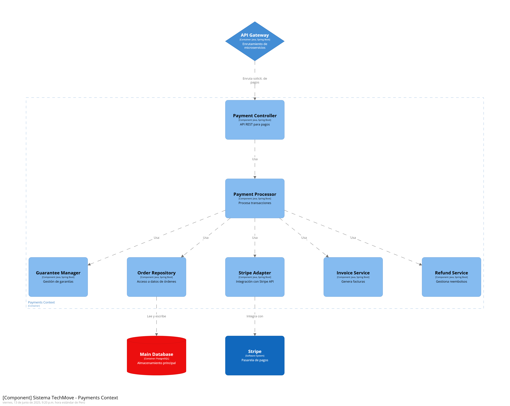

# Informe del Trabajo Final

**Universidad Peruana de Ciencias Aplicadas**

**Ingeniería de software**

**Desarrollo de Aplicaciones Open Source**

**Sección:** 4310

**Profesor:** Ivan Robles Fernández

**Nombre del StartUp:** TechMove

**Nombre del Producto:** FixNow

| Nombre                              | Código    |
| ----------------------------------- | ---------- |
| Bustamante Leveau Cameron Charllotte | u20231a804 |
| Urrutia Peña Jasmin Adriana          | u202310008 |
| Hallasi Saravia Miguel Angel | u202312391 |

**Ciclo 2025-01**

# Contenido

1. [Capítulo I: Introducción](#capítulo-i-introducción) 
    1.1. [Startup Profile](#11-startup-profile) 
    1.1.1. [Descripción de la Startup](#111-descripción-de-la-startup) 
    1.1.2. [Perfiles de integrantes del equipo](#112-perfiles-de-integrantes-del-equipo) 
    1.2. [Solution Profile](#12-solution-profile) 
    1.2.1 [Antecedentes y problemática](#121-antecedentes-y-problemática) 
    1.2.2 [Lean UX Process](#122-lean-ux-process) 
    1.2.2.1. [Lean UX Problem Statements](#1221-lean-ux-problem-statements) 
    1.2.2.2. [Lean UX Assumptions](#1222-lean-ux-assumptions) 
    1.2.2.3. [Lean UX Hypothesis Statements](#1223-lean-ux-hypothesis-statements) 
    1.2.2.4. [Lean UX Canvas](#1224-lean-ux-canvas) 
    1.3. [Segmentos objetivo](#13-segmentos-objetivo) 
2. [Capítulo II: Requirements Elicitation & Analysis](#capítulo-ii-requirements-elicitation--analysis) 
   2.1. [Competidores](#21-competidores) 
   2.1.1. [Análisis competitivo](#211-análisis-competitivo) 
   2.1.2. [Estrategias y tácticas frente a competidores](#212-estrategias-y-tácticas-frente-a-competidores) 
   2.2. [Entrevistas](#22-entrevistas) 
   2.2.1. [Diseño de entrevistas](#221-diseño-de-entrevistas) 
   2.2.2. [Registro de entrevistas](#222-registro-de-entrevistas) 
   2.2.3. [Análisis de entrevistas](#223-análisis-de-entrevistas) 
   2.3. [Needfinding](#23-needfinding) 
   2.3.1. [User Personas](#231-user-personas) 
   2.3.2. [User Task Matrix](#232-user-task-matrix) 
   2.3.3. [User Journey Mapping](#232-user-task-matrix) 
   2.3.4. [Empathy Mapping](#234-empathy-mapping) 
   2.3.5. [As-is Scenario Mapping](#235-as-is-scenario-mapping) 
   2.4. [Ubiquitous Language](#24-ubiquitous-language) 
3. [Capítulo III: Requirements Specification](#capítulo-iii-requirements-specification) 
   3.1. [To-Be Scenario Mapping](#31-to-be-scenario-mapping) 
   3.2. [User Stories](#32-user-stories) 
   3.3. [Impact Mapping](#33-impact-mapping) 
   3.4. [Product Backlog](#34-product-backlog) 
4. [Capítulo IV: Product Design](#capítulo-iv-product-design) 
   4.1. [Style Guidelines](#41-style-guidelines) 
   4.1.1. [General Style Guidelines](#411-general-style-guidelines) 
   4.1.2. [Web Style Guidelines](#412-web-style-guidelines) 
   4.2. [Information Architecture](#42-information-architecture) 
   4.2.1. [Organization Systems](#421-organization-systems) 
   4.2.2. [Labeling Systems](#422-labeling-systems) 
   4.2.3. [SEO Tags and Meta Tags](#423-seo-tags-and-meta-tags) 
   4.2.4. [Searching Systems](#424-searching-systems) 
   4.2.5. [Navigation Systems](#425-navigation-systems) 
   4.3. [Landing Page UI Design](#43-landing-page-ui-design) 
   4.3.1. [Landing Page Wireframe](#431-landing-page-wireframe) 
   4.3.2. [Landing Page Mock-up](#432-landing-page-mock-up) 
   4.4. [Web Applications UX/UI Design](#44-web-applications-uxui-design) 
   4.4.1. [Web Applications Wireframes](#441-web-applications-wireframes) 
   4.4.2. [Web Applications Wireflow Diagrams](#442-web-applications-wireflow-diagrams) 
   4.4.2. [Web Applications Mock-ups](#442-web-applications-mock-ups) 
   4.4.3. [Web Applications User Flow Diagrams](#443-web-applications-user-flow-diagrams) 
   4.5. [Web Applications Prototyping](#45-web-applications-prototyping) 
   4.6. [Domain-Driven Software Architecture](#46-domain-driven-software-architecture) 
   4.6.1. [Software Architecture Context Diagram](#461-software-architecture-context-diagram) 
   4.6.2. [Software Architecture Container Diagrams](#462-software-architecture-container-diagrams) 
   4.6.3. [Software Architecture Components Diagrams](#463-software-architecture-components-diagrams) 
   4.7. [Software Object-Oriented Design](#47-software-object-oriented-design) 
   4.7.1. [Class Diagrams](#471-class-diagrams) 
   4.7.2. [Class Dictionary](#472-class-dictionary) 
   4.8. [Database Design](#48-database-design) 
   4.8.1. [Database Diagram](#481-database-diagram) 
5. [Capítulo V: Product Implementation, Validation & Deployment](#capítulo-v-product-implementation-validation--deployment) 
   5.1. [Software Configuration Management](#51-software-configuration-management) 
   5.1.1. [Software Development Environment Configuration](#511-software-development-environment-configuration) 
   5.1.2. [Source Code Management](#512-source-code-management) 
   5.1.3. [Source Code Style Guide & Conventions](#513-source-code-style-guide--conventions) 
   5.1.4. [Software Deployment Configuration](#514-software-deployment-configuration) 
   5.2. [Landing Page, Services & Applications Implementation](#52-landing-page-services--applications-implementation) 
   5.2.1. [Sprint 1](#521-sprint-1) 
   5.2.1.1. [Sprint Planning 1](#5211-sprint-planning-1) 
   5.2.1.2. [Aspect Leaders and Collaborators](#5212-aspect-leaders-and-collaborators) 
   5.2.1.3. [Sprint Backlog 1](#5213-sprint-backlog-1) 
   5.2.1.4. [Development Evidence for Sprint Review](#5214-development-evidence-for-sprint-review) 
   5.2.1.5. [Execution Evidence for Sprint Review](#5215-execution-evidence-for-sprint-review) 
   5.2.1.6. [Services Documentation Evidence for Sprint Review](#5216-services-documentation-evidence-for-sprint-review) 
   5.2.1.7. [Software Deployment Evidence for Sprint Review](#5217-software-deployment-evidence-for-sprint-review) 
   5.2.1.8. [Team Collaboration Insights during Sprint](#5218-team-collaboration-insights-during-sprint) 

6. [Conclusiones](#conclusiones) 
   6.1 [Conclusiones y recomendaciones](#61-conclusiones-y-recomendaciones) 
7. [Bibliografía](#bibliografía) 
8. [Anexos](#anexos) 

# Student Outcomes

# Capítulo I: Introducción

## 1.1. Startup Profile

### 1.1.1. Descripción de la Startup

### 1.1.2. Perfiles de integrantes del equipo

## 1.2. Solution Profile

### 1.2.1 Antecedentes y problemática

### 1.2.2 Lean UX Process

#### 1.2.2.1. Lean UX Problem Statements

#### 1.2.2.2. Lean UX Assumptions
##### 1.2.2.2.1. Features

##### 1.2.2.2.2. Business Outcomes

##### 1.2.2.2.3. User Benefits

#### 1.2.2.3. Lean UX Hypothesis Statements.

#### 1.2.2.4. Lean UX Canvas.

## 1.3. Segmentos objetivo.

# Capítulo II: Requirements Elicitation & Analysis

## 2.1. Competidores.

### 2.1.1. Análisis competitivo.

### 2.1.2. Estrategias y tácticas frente a competidores.

## 2.2. Entrevistas.

### 2.2.1. Diseño de entrevistas.

### 2.2.2. Registro de entrevistas.

### 2.2.3. Análisis de entrevistas.

## 2.3. Needfinding.

### 2.3.1. User Personas.

### 2.3.2. User Task Matrix.

### 2.3.3. User Journey Mapping.

### 2.3.4. Empathy Mapping.

#### User Persona 1: Luis Gutiérrez (Profesional Técnico)

#### User Persona 2: Mariana Rodríguez (Cliente)

### 2.3.5. As-is Scenario Mapping.

#### User Persona 1: Luis Gutiérrez (Profesional Técnico)

#### User Persona 2: Mariana Rodríguez (Cliente)

## 2.4. Ubiquitous Language.

En esta sección se presenta un glosario de términos y conceptos utilizados en el dominio de negocio de FixNow.

| Término en Inglés (Español) | Definición |
|----------------------------|------------|
| Account (Cuenta) | Representa la identidad digital de un usuario en la plataforma. Contiene las credenciales de acceso y el estado de la cuenta. |
| User (Usuario) | Entidad base que representa a cualquier persona registrada en la plataforma, conteniendo su información personal básica. |
| Customer (Cliente) | Usuario que busca servicios técnicos o profesionales a través de la plataforma. |
| Worker (Trabajador Técnico) | Profesional técnico que ofrece sus servicios a través de la plataforma. Cuenta con experiencia verificable, habilidades específicas y certificaciones en su campo. |
| Experience (Experiencia) | Registro histórico laboral de un Worker que valida su trayectoria profesional en diferentes empresas o roles. |
| Review (Reseña) | Evaluación y comentario que un usuario realiza sobre el servicio recibido o proporcionado. |
| Proposal (Propuesta) | Oferta formal de servicio que un Worker presenta a un Customer, incluyendo descripción del trabajo, precio y tiempo estimado. |
| Chat (Chat) | Espacio de comunicación directa entre Customer y Worker para coordinar detalles del servicio. |
| Message (Mensaje) | Unidad de comunicación dentro de un chat entre participantes. |
| Sales Order Payment (Orden de Pago) | Registro financiero que documenta la transacción entre un Customer y un Worker por los servicios acordados. |
| Ticket (Reclamo) | Registro formal de una disputa o inconformidad entre Customer y Worker que requiere resolución por parte de la plataforma. |
| Hourly Rate (Tarifa por Hora) | Monto que un Worker establece como su tarifa de servicio por hora de trabajo. |
| Field (Campo de Especialidad) | Área específica de expertise técnico en la que se desempeña un Worker. |
| Skills (Habilidades) | Conjunto de competencias técnicas específicas que posee un Worker. |

# Capítulo III: Requirements Specification

## 3.1. To-Be Scenario Mapping.

## 3.2. User Stories.

### 3.2.3 User Stories

### 3.2.4 Technical Stories

## 3.3. Impact Mapping.

## 3.4. Product Backlog.

# Capítulo IV: Product Design

## 4.1.1 Style Guidelines. 
Esta sección establece las bases visuales y comunicacionales de Fix Now, garantizando coherencia en toda la experiencia digital. Se crea un repositorio común para el equipo con assets gráficos, fuentes y reglas visuales que mantienen una presentación profesional, accesible y funcional tanto en web como en móvil.

### 4.1.1. General Style Guidelines.

La identidad de Fix Now se basa en transmitir profesionalismo, eficiencia y cercanía. La marca busca posicionarse como una solución tecnológica de confianza para quienes necesitan servicios técnicos de calidad, así como para quienes desean monitorear el consumo de recursos en sus hogares de manera sencilla. Por eso se escogieron los siguientes style guidelines.

#### Typography
Para lograr una lectura cómoda y moderna, se seleccionó una combinación de tipografías con diferentes pesos y estilos que permiten estructurar jerarquías claras.
- Montserrat y Poppins se utilizan en titulares por su robustez y claridad visual.
  
  
  
- Open Sans, DM Sans y Onest están destinados a párrafos y descripciones, aportando legibilidad y neutralidad.
  
   
   
- Tipografías como Playfair Display, Playfair Display SC y Playwrite US Trad se usan en títulos decorativos o frases clave, mientras que Dancing Script aporta un toque más expresivo en elementos visuales que buscan una conexión emocional.
  
  

#### Colors
 La paleta cromática fue cuidadosamente seleccionada para proyectar seguridad, eficiencia y modernidad:
 
- Primarios:
	- #29405A: azul profundo que transmite confianza y estabilidad.
	- #2247C0: azul intenso que denota tecnología y profesionalismo.
	- #3E72AD: azul medio que aporta frescura y balance.
   
 	  
   	  

- Secundarios:
	- #42CACA: tono aqua que brinda dinamismo, innovación y frescura.
	- #FFD900: amarillo brillante para llamados a la acción y elementos importantes.
 
   	

    
- Neutros:
	- #000000, #D9D9D9, y #FFFFFF para mantener limpieza visual y contraste en la interfaz.
   
   	

#### Botones: Los botones de Fix Now son llamativos, accesibles y fáciles de identificar. Tienen esquinas redondeadas, efectos al hacer hover.

	

#### Iconografia: La iconografía sigue un estilo minimalista y lineal, con íconos fácilmente reconocibles que mejoran la navegación.

#### Logo:	El logo de Fix Now combina tipografía moderna con un ícono representativo de tecnología y reparación. Refleja los valores de rapidez y confianza.

### 4.1.2. Web Style Guidelines.

La experiencia web de Fix Now está diseñada pensando en una navegación intuitiva, con elementos visuales bien jerarquizados y adaptados a distintos tamaños de pantalla.

- Se prioriza la legibilidad y claridad, con títulos grandes, espacios generosos y botones que destacan sobre el fondo.
- Los botones tienen esquinas redondeadas, efectos de hover suaves, y cambios de color que comunican interactividad.
- Las interfaces están construidas para ser completamente responsive, adaptándose fluidamente a dispositivos como laptops, tablets y pantallas grandes.
- Las tarjetas, formularios y paneles están diseñados siguiendo un estilo limpio, con íconos explicativos y elementos interactivos fácilmente reconocibles.

Para el diseño de la landing page de Fix Now se utilizó el patrón Z debido a su eficacia en la lectura y escaneo visual en pantallas. Este patrón guía naturalmente la vista del usuario desde la parte superior izquierda hacia la derecha, bajando diagonalmente hasta el extremo inferior izquierdo y finalmente hacia la derecha otra vez, formando una "Z". Al seguir este recorrido visual intuitivo, se mejora la jerarquía de la información, se capta la atención del usuario rápidamente y se optimiza la conversión desde los primeros segundos de interacción.

## 4.2. Information Architecture.
La arquitectura de información de Fix Now está estructurada con base en la claridad y facilidad de uso. Se ha diseñado pensando en minimizar la carga cognitiva de los usuarios y permitirles acceder rápidamente a la información o servicio que buscan. La experiencia se adapta tanto para nuevos visitantes como para usuarios frecuentes, brindando un recorrido fluido e intuitivo.

### 4.2.1. Organization Systems.
Se aplican distintos sistemas de organización según el tipo de información y contexto de uso:
- Jerarquía Visual: En la landing page y paneles, se prioriza la presentación de contenido clave en la parte superior. Títulos, botones de acción y notificaciones son fácilmente identificables.
- Organización Secuencial: El proceso de solicitar un servicio sigue pasos claros: búsqueda del técnico, selección, agenda y confirmación.
- Organización por Audiencia: Existen rutas específicas tanto para Clientes como para Técnicos, con interfaces y contenidos adaptados a sus necesidades.
- Categorización por Tópicos: El monitoreo de consumos está dividido por categorías como “Agua” y “Electricidad”, y cada tipo de servicio técnico se agrupa por especialidad (fontanero, electricista, carpintero, etc.).

### 4.2.2. Labeling Systems.
Los textos, etiquetas y botones de navegación han sido cuidadosamente definidos para evitar ambigüedades y facilitar la comprensión.
- Se priorizan palabras simples, directas y en español claro.
- Las etiquetas utilizan un máximo de 2 a 3 palabras por ítem.
Ejemplos:
- “Buscar técnico”
- “Agendar cita”
- “Consumo de agua”
- “Mis servicios”
- “Técnicos disponibles”
- “Configuración”
- “Soporte”
Además, se acompañan de íconos o descripciones breves para aumentar su reconocimiento inmediato.

### 4.2.3. SEO Tags and Meta Tags
- Landing Page (versión pública):
	- Title: Fix Now - Servicios técnicos y de mantenimiento al instante.
	- Meta Description: ¿Tienes una fuga, necesitas pintar tu casa o instalar una campana extractora?
En Fix Now te conectamos con profesionales confiables en plomería, electricidad, pintura, carpintería y mucho más.
	- Keywords: técnicos, fontaneros, electricistas, monitoreo del hogar, consumo sostenible, servicios técnicos
	- Author: Equipo de desarrollo de Fix Now

- Aplicación Web (usuarios registrados):
	- Title: Fix Now - Panel de usuario
	- Meta Description: Contamos con profesionales de distintas áreas para brindarte soluciones rápidas, confiables y de calidad.
	- Keywords: panel de usuario, servicios activos, técnicos disponibles, historial de consumo, sostenibilidad
	- Author: Fix Now App Team

### 4.2.4. Searching Systems.

El sistema de búsqueda de Fix Now está diseñado para ofrecer una experiencia fluida, incluso cuando hay una gran cantidad de servicios y técnicos disponibles.
- Buscador principal: Permite buscar técnicos por tipo de servicio.
- Filtros dinámicos:
	- Tipo de técnico (electricista, gasfitero, carpintero…)
	- Calificación promedio
	- Disponibilidad por día y hora
	- Cercanía geográfica
- Resultados visuales: Los técnicos se muestran en tarjetas con nombre, especialidad, calificación, y botón de agendar.

### 4.2.5. Navigation Systems.

Se han implementado sistemas de navegación claros, jerárquicos y adaptables según el dispositivo:
- Landing Page: Navegación superior con enlaces directos a “Inicio”, “Servicios”, “Producto”, “Testimonios”, “Contactanos” y “Registrarse”.
- Botón de acción principal: “Iniciar Sesión”, siempre visible.
- Aplicación para clientes:
	- Barra inferior con íconos para acceder a: Servicios, Monitoreo, Historial, Perfil.
- Aplicación para técnicos:
	- Panel lateral con accesos rápidos a: Nuevas solicitudes, Agenda, Mensajes, Perfil.
- Feedback visual constante: Indicadores activos, animaciones suaves y confirmaciones visuales para cada interacción.

## 4.3. Landing Page UI Design.

### 4.3.1. Landing Page Wireframe.

| Vista Previa Desktop Web Browser | Vista Previa Mobile Web Browser |
|----------------------------------|----------------------------------|
|   | |

Link:[https://www.figma.com/design/GizyZC1lEsPasOO3mWmkQI/Untitled?node-id=1-2&t=GSnzJYQiwQ39h97p-1](https://www.figma.com/design/GizyZC1lEsPasOO3mWmkQI/Untitled?node-id=1-2&t=GSnzJYQiwQ39h97p-1)

### 4.3.2. Landing Page Mock-up.
| Vista Previa Desktop Web Browser | Vista Previa Mobile Web Browser |
|----------------------------------|----------------------------------|
|   | |

Link:[https://www.figma.com/design/GizyZC1lEsPasOO3mWmkQI/Untitled?node-id=1-2&t=GSnzJYQiwQ39h97p-1](https://www.figma.com/design/GizyZC1lEsPasOO3mWmkQI/Untitled?node-id=1-2&t=GSnzJYQiwQ39h97p-1)

## 4.4. Web Applications UX/UI Design.
### 4.4.1. Web Applications Wireframes.

### 4.4.2. Web Applications Wireflow Diagrams.
 
 
 
 
 
 
 
 
 
 
 
 
 
  
 
- Link: https://lucid.app/lucidchart/c33c35cc-3799-4ebf-ba24-e5ec8b31cf8d/edit?invitationId=inv_c22e7ea2-ee1b-40db-a30f-d77ecfa9ab29

### 4.4.2. Web Applications Mock-ups.

  
  

 

- Link: https://www.figma.com/design/GizyZC1lEsPasOO3mWmkQI/Untitled?node-id=1-2&t=bn9JxBqm0EvgpIsN-1

### 4.4.3. Web Applications User Flow Diagrams.

- Link:
https://lucid.app/lucidchart/70accaac-a42d-4f91-83a4-3e0775019399/edit?viewport_loc=-713%2C-1604%2C5741%2C4711%2C0_0&invitationId=inv_c16693ff-fd14-4b88-9a95-f935ae4b70e7

- https://lucid.app/lucidchart/9cd2d50d-7265-4a09-a46d-39b10aef2813/edit?viewport_loc=2368%2C-2928%2C6217%2C4209%2C0_0&invitationId=inv_724fff12-fb12-4fe6-9bd5-f1d5ffbbaa85

## 4.5. Web Applications Prototyping.

- Link video Prototipo:
  https://youtu.be/Kb-64_BmUtE
- Link Figma donde se realizó el Prototipo:
  https://www.figma.com/design/kEbEQEcTbGo7wVLYAmGe6s/Untitled?node-id=0-1&t=h5yMVfbwRTA4dOv0-1

## 4.6. Domain-Driven Software Architecture.

### 4.6.1. Software Architecture Context Diagram.

### 4.6.2. Software Architecture Container Diagrams.

### 4.6.3. Software Architecture Components Diagrams.

#### User component

#### Auth component

#### Payment component

#### Proposals component

### 4.7. Software Object-Oriented Design.

### 4.7.1. Class Diagrams.

### 4.7.2. Class Dictionary.

| Clase                        | Atributos y Métodos                                                                                                                                                                                                                                                                                                                                                                                                                                                                                                                                                                                                                                                                                                                                                                                                                                                                                 |
|------------------------------|---------------------------------------------------------------------------------------------------------------------------------------------------------------------------------------------------------------------------------------------------------------------------------------------------------------------------------------------------------------------------------------------------------------------------------------------------------------------------------------------------------------------------------------------------------------------------------------------------------------------------------------------------------------------------------------------------------------------------------------------------------------------------------------------------------------------------------------------------------------------------------------------------------|
| **Account** (Entidad)        | - `accountId: AccountId` – Identificador único de la cuenta. - `email: String` – Dirección de correo electrónico. - `passwordHash: String` – Hash de la contraseña. - `status: String` – Estado de la cuenta (e.g., Activo, Inactivo). - `activate(): void` – Activa la cuenta. - `deactivate(): void` – Desactiva la cuenta. - `isActive(): Boolean` – Comprueba si la cuenta está activa.                                                                                                                                                                                                                                                                                                                                                                                                                                                                                   |
| **User** (AggregateRoot)     | - `userId: UUID` – Identificador único del usuario. - `accountId: AccountId` – Cuenta asociada. - `firstName: String` – Nombre. - `lastName: String` – Apellidos. - `email: String` – Correo electrónico. - `description: String` – Perfil o biografía. - `role: String` – Rol (Admin, Worker, Customer). - `updateUserInfo(firstName, lastName, description): void` – Actualiza nombre, apellidos y descripción.                                                                                                                                                                                                                                                                                                                                                                                                                                    |
| **Customer** (Entidad)       | - `customerId: UUID` – Identificador único del cliente. - `userId: UUID` – Usuario asociado. - `createdAt: Date` – Fecha de creación.                                                                                                                                                                                                                                                                                                                                                                                                                                                                                                                                                                                                                                                                                                                                                           |
| **Worker** (Entidad)         | - `workerId: UUID` – Identificador único del trabajador. - `userId: UUID` – Usuario asociado. - `field: String` – Área o especialidad. - `experience: List<Experience>` – Experiencias laborales. - `skills: List<String>` – Habilidades. - `certifications: List<String>` – Certificaciones. - `availability: Money` – Disponibilidad económica. - `hourlyRate: Money` – Tarifa por hora. - `projectsCompleted: int` – Proyectos completados. - `externalRecommendations: List<String>` – Recomendaciones externas. - `updateWorkerInfo(newData): void` – Actualiza datos del trabajador. - `addExperience(exp: Experience): void` – Agrega experiencia. - `removeExperience(exp: Experience): void` – Elimina experiencia. |
| **Experience** (ValueObject) | - `company: String` – Empresa. - `role: String` – Cargo. - `startDate: Date` – Fecha de inicio. - `endDate: Date` – Fecha de fin. - `isCurrently: Boolean` – Está en curso. - `updateExperienceInfo(company, role, dates): void` – Actualiza datos de la experiencia.                                                                                                                                                                                                                                                                                                                                                                                                                                                                                                                                                                         |
| **Review** (Entidad)         | - `reviewId: ReviewId` – Identificador único de la reseña. - `fromUserId: AccountId` – Cuenta autora. - `toUserId: AccountId` – Cuenta destinataria. - `rating: Int` – Calificación. - `comment: String` – Comentario. - `createdAt: Date` – Fecha de creación. - `updateComment(comment: String): void` – Modifica el comentario.                                                                                                                                                                                                                                                                                                                                                                                                                                                                                                                         |
| **Proposal** (AggregateRoot) | - `proposalId: UUID` – Identificador único de la propuesta. - `workerId: AccountId` – Cuenta del trabajador. - `customerId: AccountId` – Cuenta del cliente. - `title: String` – Título. - `description: String` – Descripción. - `price: Money` – Precio. - `estimatedTime: String` – Tiempo estimado. - `status: String` – Estado (Submitted, InProgress, Completed, Rejected). - `submittedAt: Date` – Fecha de envío. - `accept(): void` – Acepta la propuesta. - `reject(): void` – Rechaza la propuesta. - `markAsInProgress(): void` – Marca en progreso. - `completeProposal(): void` – Marca como completada.                          |
| **GuaranteePayment** (VO)    | - `percentage: Double` – Porcentaje de garantía. - `amount: Money` – Monto de garantía. - `isValid(): Boolean` – Valida el pago. - `fromProposal(m: Money): GuaranteePayment` – Construye a partir del precio de la propuesta.                                                                                                                                                                                                                                                                                                                                                                                                                                                                                                                                                                                                           |
| **SalesOrder_Payment** (AR)  | - `orderId: UUID` – Identificador del pedido. - `customerId: AccountId` – Cuenta del cliente. - `workerId: AccountId` – Cuenta del trabajador. - `proposalId: UUID` – Propuesta asociada. - `totalAmount: Money` – Monto total. - `guaranteePaid: GuaranteePayment` – Pago de garantía. - `paymentStatus: String` – Estado del pago (Pending, Paid). - `createdAt: Date` – Fecha de creación. - `registerGuaranteePayment(g: GuaranteePayment): void` – Registra garantía. - `markAsPaid(): void` – Marca como pagado.                                                  |
| **Chat** (AggregateRoot)     | - `chatId: UUID` – Identificador del chat. - `participants: List<UUID>` – IDs de participantes. - `createdAt: Date` – Fecha de creación. - `addParticipant(id: UUID): void` – Añade participante.                                                                                                                                                                                                                                                                                                                                                                                                                                                                                                                                                                                                                                       |
| **Message** (Entidad)        | - `messageId: UUID` – Identificador del mensaje. - `chatId: UUID` – Chat asociado. - `senderId: UUID` – Remitente. - `content: String` – Contenido. - `timestamp: Date` – Fecha y hora.                                                                                                                                                                                                                                                                                                                                                                                                                                                                                                                                                                                                                                              |
| **AccountId** (VO)           | - `value: UUID` – Valor del identificador. - `equals(a: AccountId): Boolean` – Compara dos IDs.                                                                                                                                                                                                                                                                                                                                                                                                                                                                                                                                                                                                                                                                                                                                                                                                         |
| **ReviewId** (VO)            | - `value: UUID` – Valor del identificador.                                                                                                                                                                                                                                                                                                                                                                                                                                                                                                                                                                                                                                                                                                                                                                                                                                                             |
| **Money** (ValueObject)      | - `amount: BigDecimal` – Monto. - `currency: String` – Divisa (USD, EUR…). - `add(m: Money): Money` – Suma montos. - `subtract(m: Money): Money` – Resta montos.                                                                                                                                                                                                                                                                                                                                                                                                                                                                                                                                                                                                                                                                                                                                 |

## 4.8. Database Design.

### 4.8.1. Database Diagram.

# Capítulo V: Product Implementation, Validation & Deployment

## 5.1. Software Configuration Management.
En esta sección el equipo establece las decisiones y convenciones que permitirán mantener la consistencia durante el ciclo de vida. Se incluyen secciones internas para Source Code Management, Development Environment Configuration y Deployment Configuration

## 5.1.1. Software Development Environment Configuration.

El equipo utiliza diversas herramientas en cada etapa del trabajo, desde la planificación hasta la ejecución y finalización del proyecto

**Herramientas usadas:**

**WhatsApp:** Aplicación de mensajería instantánea, disponible para Android e iOS. Es parte de Meta y cuenta con una versión web. [https://www.whatsapp.com/].

**Discord:** Aplicación que permite la creación de un servidor que permite la creación de salas [https://discord.com/].

#### Project Management

**Trello:** Se utilizará para gestionar el Product Backlog, planificar los sprints y organizar las tareas. Trello permite a los miembros del equipo visualizar el progreso, gestionar prioridades y facilitar la colaboración mediante tableros y listas.  
**Beneficio:** Facilita la visibilidad del estado de cada tarea, mejora la planificación y permite una mayor agilidad en la ejecución de los sprints.

#### Requirements Management

- **Miro:** Ayudará a administrar ideas, gestionar User Stories y planificar requisitos. Es una herramienta visual colaborativa que permite crear diagramas y mapas conceptuales.  
  **Beneficio:** Mejora la claridad y alineación entre los stakeholders, permite la rápida iteración y evaluación de ideas, y ayuda a consolidar los requisitos del producto.

#### Software Development

-    **WebStorm:** Un IDE especializado en el desarrollo de aplicaciones web con tecnologías como JavaScript, HTML, CSS y Vue.js.
    **Beneficios:** WebStorm ofrece características avanzadas como el autocompletado de código, depuración en tiempo real e integración con herramientas de control de versiones como Git, mejorando la productividad del equipo de frontend.
-    **Angular**: Framework de desarrollo web basado en TypeScript, utilizado para crear aplicaciones web dinámicas, escalables y de alto rendimiento.
    **Beneficios:** Angular ofrece una arquitectura robusta basada en componentes reutilizables, inyección de dependencias y enlace bidireccional de datos, lo que permite desarrollar interfaces ricas de manera estructurada. Además, su CLI (Command Line Interface) facilita la generación de código, pruebas y               despliegue, mejorando la eficiencia del equipo de desarrollo.
-    **Github**: Plataforma para la gestión del código fuente, donde se integrará el código a través del control de versiones. Permite la colaboración en equipo y un flujo de trabajo ordenado mediante pull requests, revisiones de código, y la implementación de integraciones continuas.
    **Beneficios:** GitHub asegura la trazabilidad de los cambios en el código, ofrece control sobre versiones estables y facilita la colaboración entre desarrolladores

#### Software Testing

-    **Google Drive:** Herramienta colaborativa para documentar 
    **Beneficios:** Proporciona una plataforma para la creación de documentación técnica y pruebas en equipo

### 5.1.2. Source Code Management.

El equipo utilizará GitHub como plataforma de control de versiones, apoyado en el sistema Git. Esta herramienta facilita la colaboración entre los miembros del equipo, permitiendo trabajar de forma simultánea y organizada. 
Enlace al repositorio Gihub: https://github.com/TechMove-AW/FixNow   
Enlace al landing page: https://github.com/TechMove-AW/FixNow-LandingPage  
**Flujo de trabajo con GitFlow** 
Para el control de versiones se adoptará el modelo GitFlow, descrito por Vincent Driessen, el cual establece una estructura clara para el desarrollo colaborativo mediante ramas específicas:
-    **main:** Rama principal que contiene las versiones estables del proyecto.
-    **develop:** Rama donde se integran las nuevas funcionalidades antes de pasar a producción.
-    **Feature:** Ramas individuales para cada funcionalidad nueva. Se derivan desde develop y se nombran siguiendo el formato feature/nombre-descriptivo. 
**Conventional Commits**  
Para mantener un historial de commits claro y estructurado, se empleará la convención Conventional Commits, que utiliza el siguiente formato: 
Ejemplos de tipos comunes: 
-    **feat:** Nueva funcionalidad
-    **fix:** Corrección de errores
-    **docs:** Cambios en la documentación
-    **style:** Cambios de formato (indentación, espacios, etc.)
-    **refactor:** Refactorización del código sin cambio de comportamiento
-    **test:** Agregado o modificación de pruebas
-    **chore:** Cambios en tareas de configuración o mantenimiento

### 5.1.3. Source Code Style Guide & Conventions.
El equipo adoptará guías de estilo y convenciones para asegurar que el código sea limpio, legible y mantenible. Estas convenciones abarcan diversos lenguajes y tecnologías, cada una con recomendaciones específicas para mantener la calidad y coherencia en el código. 

**HTML/CSS** 
-    Guía de estilo: Se basará en la Google HTML/CSS Style Guide. Esta guía proporciona directrices sobre la estructura y formato del HTML y CSS, incluyendo la indentación, el uso de comentarios y la organización del código para mejorar la legibilidad y el mantenimiento.
-    Nomenclatura: Se utilizará la metodología BEM (Block Element Modifier). BEM es una metodología que ayuda a crear una estructura modular y reutilizable en CSS, facilitando la comprensión y mantenimiento del código. Consiste en una convención de nombres para clases que mejora la claridad y la organización del CSS. 

**JavaScript** 
-    Framework: Se utilizará Angular para el desarrollo de componentes reutilizables y la gestión de la interfaz de usuario. Angular es un framework de desarrollo web robusto y completo, mantenido por Google, que facilita la creación de aplicaciones SPA (Single Page Applications) con una arquitectura modular y escalable.
-    Guía de estilo: Se seguirá la Angular Style Guide junto con la Google JavaScript Style Guide. La guía de estilo de Angular proporciona buenas prácticas y convenciones específicas para el desarrollo de aplicaciones Angular, promoviendo una estructura de proyecto coherente, mantenible y escalable. 
**Gherkin** 
-    Guía de estilo: Se aplicarán las Gherkin Conventions for Readable Specifications. Gherkin es un lenguaje de especificación utilizado para escribir pruebas automatizadas de comportamiento (BDD). Esta guía proporciona recomendaciones para escribir características y escenarios de manera clara y comprensible, facilitando la colaboración entre desarrolladores y no desarrolladores. 

### 5.1.4. Software Deployment Configuration.
La configuración del despliegue garantizará que las aplicaciones se ejecuten de manera eficiente y sin errores en los entornos de producción. Se implementarán las siguientes prácticas y herramientas para asegurar un proceso de despliegue ágil, fiable y automatizado: 
-    **Landing Page:** 
    -    **Plataforma de Despliegue:** La página de aterrizaje será desplegada en GitHub, aprovechando su integración directa con el control de versiones de GitHub. Esto permite que el contenido sea publicado y actualizado automáticamente en el dominio asociado. 
    -    **Flujo de Trabajo CI/CD:** Se implementará un flujo de trabajo de Integración y Despliegue Continuos (CI/CD). Cada vez que se realice un push en la rama principal (main o master), GitHub Actions se encargará de construir y desplegar la página automáticamente. Esta integración continua asegura que los cambios en el código se reflejen de inmediato en el entorno de producción sin intervención manual. 

**Integrantes del equipo:**

| **Correo Electrónico**          | **Nombre Completo**              |
|---------------------------------|----------------------------------|
| U20231a804@upc.edu.pe           | Bustamante Leveau, Cameron Charllotte       |
| u202218634@upc.edu.pe           | De La Cruz Moreno, Roy Hernan |
| u202312391@upc.edu.pe           | Hallasi Saravia, Miguel Angel     |
| U202319563@upc.edu.pe           | Muñiz Huayanca .Percy Alonso  |
| U202310008@upc.edu.pe           | Urrutia Peña, Jasmin Adriana|

## 5.2. Landing Page, Services & Applications Implementation.

### 5.2.1. Sprint 1

#### 5.2.1.1. Sprint Planning 1.
El primer sprint se planificó durante una reunión en discord. Para ello, se creó una tabla para documentar la información discutida.

|Sprint #                          |Sprint 1|
|----                              |-----|
|**Sprint Planning Background**        ||
|Date                              |2025-04-20|
|Time                              |05:00 PM|
|Location                          |Virtual (Discord)|
|Prepared by                       |Urrutia Peña, Jasmin Adriana|
|Attendees (to planning meeting)   |Bustamante Leveau, Cameron Charllotte   De La Cruz Moreno, Roy Hernan  Hallasi Saravia, Miguel Angel  Muñiz Huayanca , Percy Alonso   Urrutia Peña, Jasmin Adriana|
|Sprint n - 1 Review Summary       |No hubo sprint anterior|
|Sprint n - 1 Retrospective Summary|No hubo sprint anterior|
|**Sprint Goal & User Stories**        ||
|Sprint 1 Goal                     |Realizar el Landing Page|
|Sprint 1 Velocity                 |20|
|Sum of Story Points               |20|

#### 5.2.1.2. Aspect Leaders and Collaborators.

#### 5.2.1.3. Sprint Backlog 1.

#### 5.2.1.4. Development Evidence for Sprint Review.
Se realizaron los avances con los commits correspondiente en el repositorio de la siguiente forma.

Repositorio Landing Page: https://github.com/TechMove-AW/FixNow-LandingPage

| Repository  | Branch              | Commit Id | Commit Message                                       | Committed on (Date) |
|-------------|---------------------|-----------|------------------------------------------------------|---------------------|
| TechMove-AW | develop             | 952f686   | Merge pull request #6 from TechMove-AW/develop       | Apr 23, 2025        |
| TechMove-AW | develop                     | 59538ff   | fix image to styles.css                              | Apr 23, 2025        |
| TechMove-AW | release/v1.0.0      | eff5d15   | Merge branch 'release/v1.0.0'                      | Apr 23, 2025        |
| TechMove-AW | feature/contactos   | 1e38428   | Merge pull request #5 from TechMove-AW/feature/contactos | Apr 23, 2025        |
| TechMove-AW | feature/testimonios | 5694c55   | Merge pull request #4 from TechMove-AW/feature/testimonios | Apr 23, 2025        |
| TechMove-AW | feature/producto-iot| 556d183   | Merge pull request #3 from TechMove-AW/feature/producto-iot | Apr 23, 2025        |
| TechMove-AW | feature/sevicios    | 5405f13   | Merge pull request #2 from TechMove-AW/feature/sevicios | Apr 23, 2025        |
| TechMove-AW | feature/ver-mas     | bccec79   | Merge pull request #1 from TechMove-AW/feature/ver-mas | Apr 23, 2025        |
| TechMove-AW | develop                     | 36886fb   | Add files via upload                                 | Apr 23, 2025        |
| TechMove-AW |  develop                    | 94b8d04   | feat: Agregue el apartado de testimonios             | Apr 23, 2025        |
| TechMove-AW |  develop                    | 7647f47   | feat(contact): agregar formulario de contacto          | Apr 23, 2025        |
| TechMove-AW | develop                     | 84b010b   | feat: ver mas                                        | Apr 23, 2025        |
| TechMove-AW | develop                     | 8eefadf   | feat: IoTproduct                                     | Apr 23, 2025        |
| TechMove-AW | develop                     | 72f93d8   | feat: add services section                           | Apr 23, 2025        |
| TechMove-AW |  develop                    | 3b2fa07   | Create index.html                                    | Apr 23, 2025        |
| TechMove-AW | main                    | f8b6217   | Initial commit                                       | Apr 23, 2025        |

#### 5.2.1.5. Execution Evidence for Sprint Review.
En esta parte se presentará el progreso alcanzado durante el primer sprint, enfocado en la implementación de la Landing Page estática. Para ilustrar este avance, se ha creado el siguiente video

URL del video:https://youtu.be/sefT6klhVpI  

* Fix Now pestaña principal  

* Ver mas 

* Servicios 

* Producto Iot  

* Testimonios  

* Contacto  

 

#### 5.2.1.6. Services Documentation Evidence for Sprint Review.
Durante este primer sprint, nos enfocamos únicamente en la creación de la Landing Page estática, por lo que no se trabajó con servicios web. Como resultado, en esta ocasión no se elaboró la documentación correspondiente al uso de servicios web.

#### 5.2.1.7. Software Deployment Evidence for Sprint Review.
Al finalizar el trabajo con todas las historias de usuario, realizamos el despliegue de la Landing Page utilizando GitHub Pages.

URL de despliegue de la Landing Page: https://github.com/TechMove-AW/FixNow-LandingPage

* Para realizar el despliegue, accedimos a la configuración del repositorio y navegamos a la sección de Pages. Posteriormente, seleccionamos la rama main desde la cual se llevará a cabo el deployment. 

* Finalmente, solo queda esperar a que GitHub genere la página y proporcione el enlace correspondiente. 

#### 5.2.1.8. Team Collaboration Insights during Sprint.
La asignación de tareas para la implementación se dividió por secciones, donde cada miembro del equipo fue responsable de desarrollar una parte de la landing page:
*    Bustamante Leveau, Cameron Charllotte: Implementacion de la seccion Contacto
*    De La Cruz Moreno, Roy Hernan:Implementacion de la seccion Producto Iot
*    Hallasi Saravia, Miguel Angel:Implementacion de la seccion Servicios
*    Muñiz Huayanca , Percy Alonso:Implementacion de la seccion Testimonios
*    Urrutia Peña, Jasmin Adriana:Implementacion de la seccion Ver mas

# Conclusiones

## 6.1 Conclusiones y recomendaciones

# Bibliografía

# Anexos
